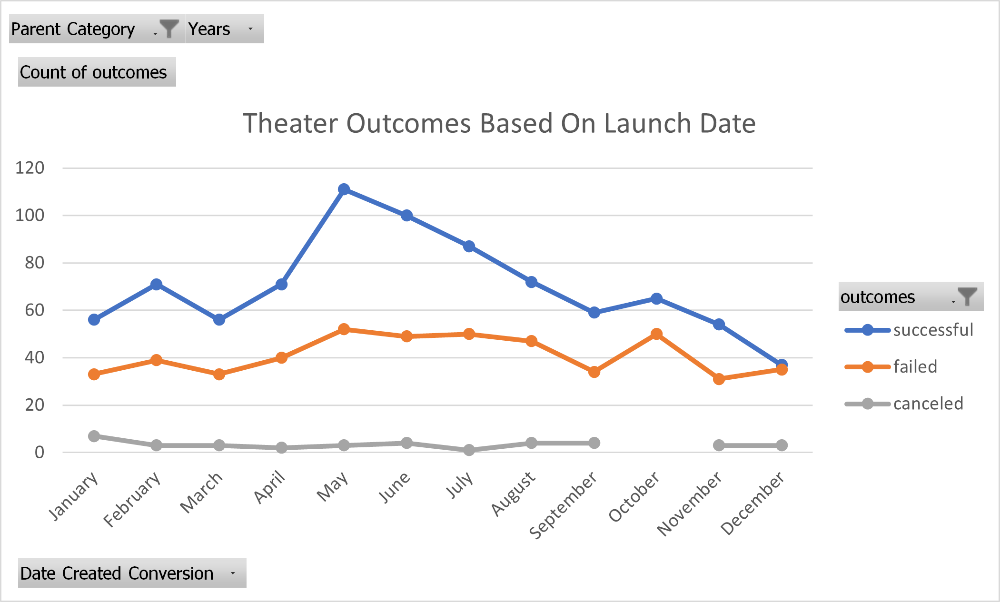
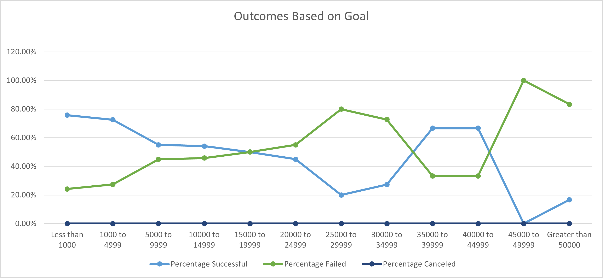

# Data analysis on Kickstarter program
## Overiew of Project
In this report, We are forcusing on data analysis of the trend relationships that how different campaigns related to their launch dates and funding goals by Lousie's data collection of serveral thousand corwdfunding projects. We are going to reveal the relationships by using professional Excel skills to Lousie, and we are visualizing the trends to solid graphs with clear views.

### Purpose
We are using the dataset to analysis how the launch dates and funding goals affect the result of fundraising differnt campaigns.After visuaization, we need to make the conlcusion based on the result.

### Analysis and Challenges Encountered
During the process of data analysis, everything went great expcet for couple things. Firstly, I have generated the graph Outcomes Based on Goal that is almost same as the sample shown in the module but the percentage sign. After some attempts, I went to the home page and selected all three rows includingpercentage successul,failed and canceled,and change the data type from general to percentage. The percentage sign showed up successfully on my graph. On the other hand, I have learned how to use the functions like year function and countifs function. The contifs function instruction are silghtly different from what is showed in the vedios. I have worked it out by typing the contifs function and observed the variable instructions shown afterward in the formula bar to input appropriate variables like the range and criteria to let the function work properly. So for next time, if I need to use a new function I have never seen before, I would like to just simply type the function in the formula bar and I could input the correct vairables by refering the variable hint.

### Analysis of Outcomes Based on Launch Dates
 As we can see from above graph, the success of theater campaign started to rise in April and had reached the peak which is about 110 campaigns in May. The difference between success and failure of campagins maximized in May as well. The difference is relatively  small in the time period from January to April and from August to Decemeber comparing the the period from May to July which indicateds that the launch date would affect the result significantly specially in Summer from May to July. It is not playing a curcial role in the rest of the year.

### Analysis of Outcomes Based on Goals

A
Results
What are two conclusions you can draw about the Outcomes based on Launch Date?

What can you conclude about the Outcomes based on Goals?

What are some limitations of this dataset?

What are some other possible tables and/or graphs that we could create?
